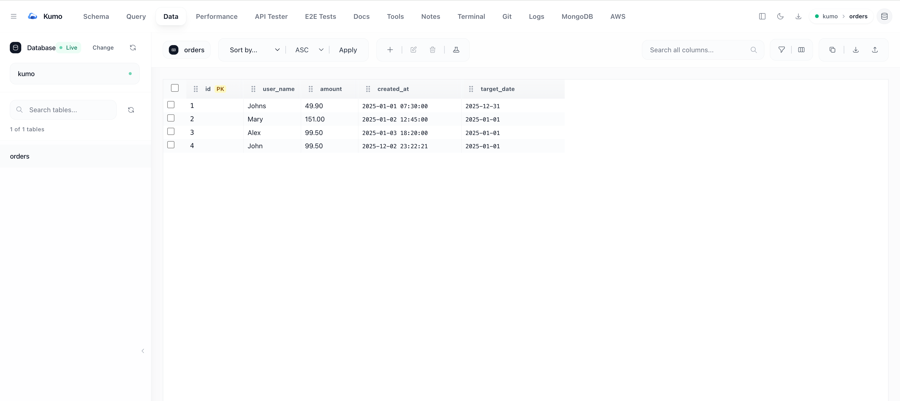
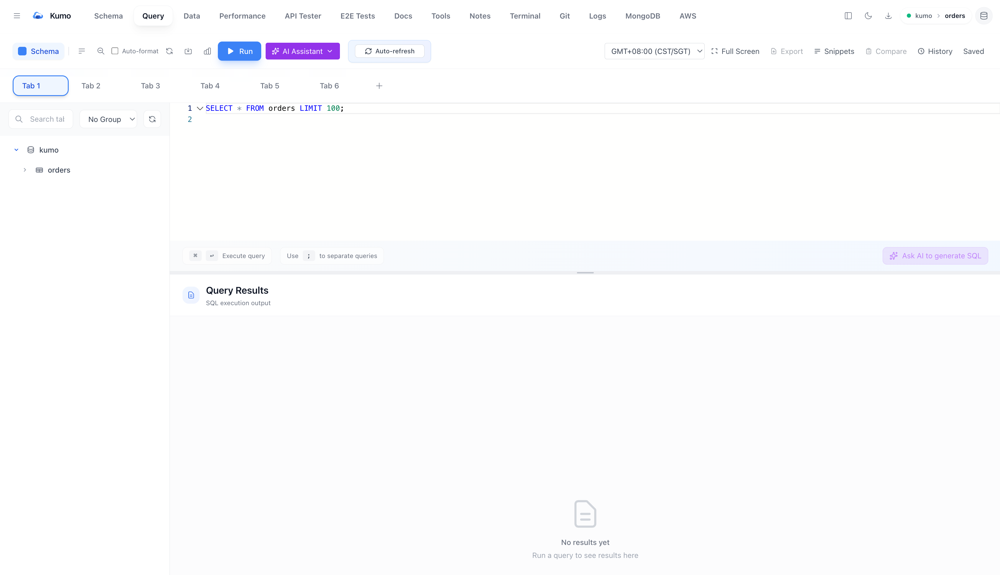
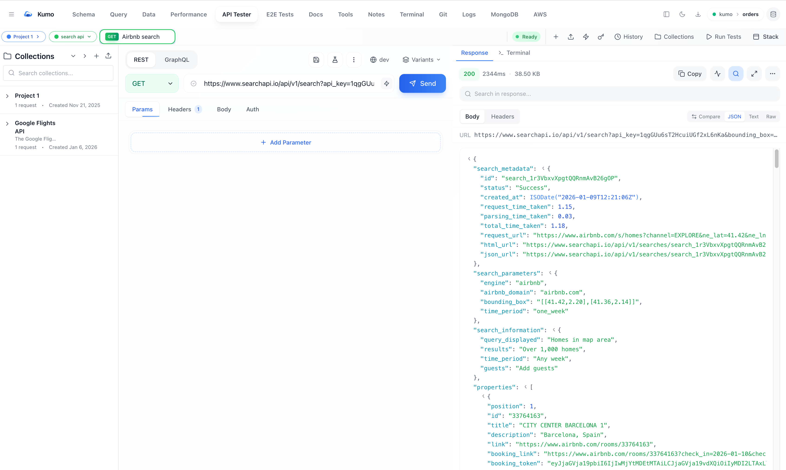
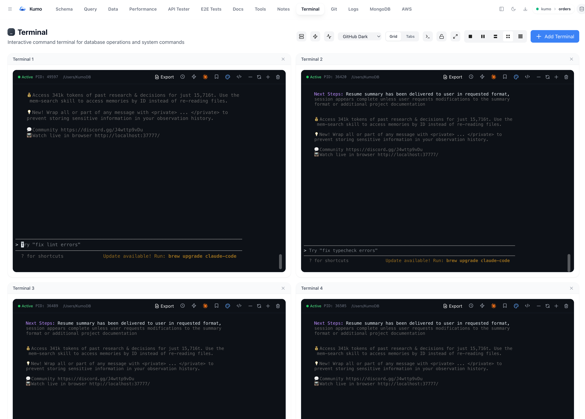
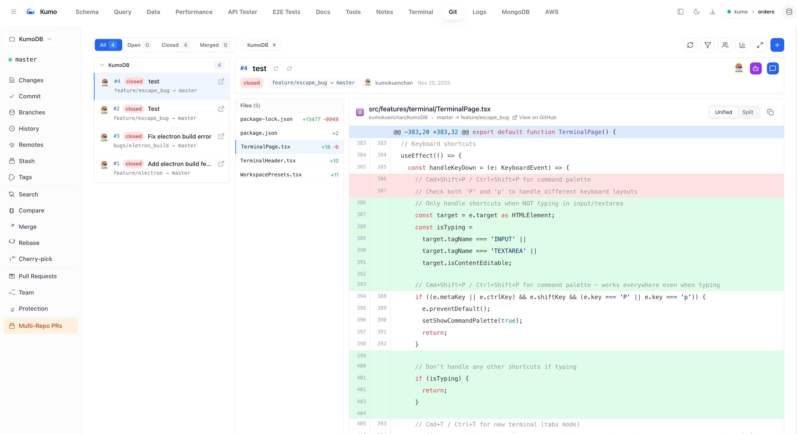
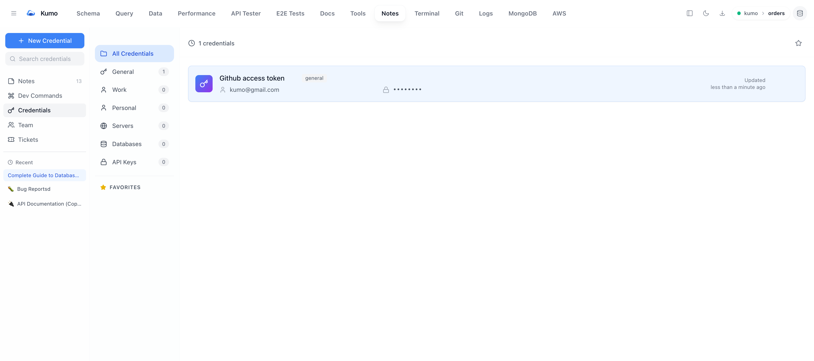
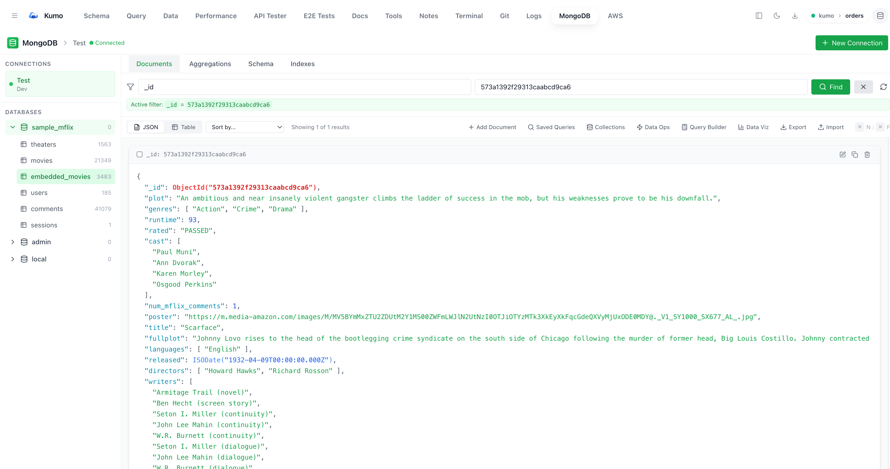
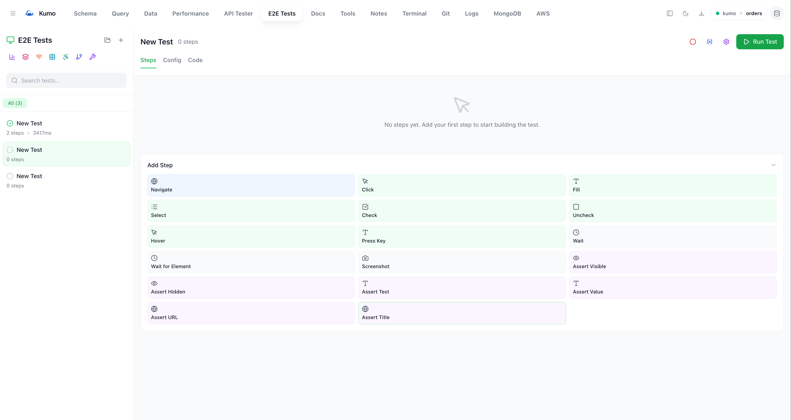

# Kumo

<div align="center">
  
  <br><br>
  <strong>Modern Database IDE for MySQL & MongoDB with Integrated API Testing, Git, and AI Assistance</strong>
  <br><br>

  [](https://github.com/kumokuenchan/Kumo)
  [](LICENSE)
  []()
  []()

  <br><br>
  A comprehensive, cross-platform database and development management application built with TypeScript, React, and Electron. Features advanced query editing, data visualization, API testing, Git integration, and powerful development tools.
  <br><br>
  
    <br>
  
    <br>
  
    <br>
  
    <br>
  
    <br>
  
    <br>
  
    <br>
  
</div>

## Features

### Database Support
- **MySQL**: Full database management with advanced query capabilities
- **MongoDB**: Native MongoDB support with document-based operations
- **Multi-Connection**: Manage multiple database connections simultaneously

### Query & Data Management
- **Advanced SQL Editor**: Monaco editor with syntax highlighting, auto-completion, query validation
- **Visual Query Builder**: Drag-and-drop SQL creation with relationship mapping (React Flow)
- **Smart Join**: Intelligent join suggestions based on foreign key relationships
- **Data Viewer**: Advanced table viewer with pagination, filtering, sorting, inline editing
- **Inline Data Editing**: Direct data modification with validation and transaction support
- **Import/Export**: Support for CSV, JSON, SQL, Excel formats
- **Query History**: Track and replay previous queries with execution statistics

### Development Tools
- **API Tester**: Built-in REST API testing with request/response management, cURL parsing
- **Saved Queries**: Store and organize frequently used queries with tagging
- **Query Analysis**: EXPLAIN analysis and performance optimization suggestions
- **Playwright Integration**: Web testing framework with visual regression testing
- **SSH Tunnel Support**: Secure remote database connections
- **Terminal Feature**: Interactive terminal with xterm.js support

### Git Integration
- **Git Browser**: Visual Git repository browser and management
- **Pull Request Viewer**: Browse and review pull requests with inline comments
- **Code Diff Viewer**: Advanced diff viewer with syntax highlighting
- **Commit History**: Full commit history with filtering and search

### Schema & Performance
- **Schema Explorer**: Visual database structure browsing with relationship diagrams
- **Performance Monitor**: Real-time query performance tracking and analysis
- **Indexes Management**: Index creation, optimization, and analysis
- **Database Management**: Database/collection creation, modification, and deletion
- **Aggregations**: MongoDB aggregation pipeline builder

### Advanced Features
- **AI-Powered Features**: Anthropic Claude integration for query assistance
- **Data Visualization**: Charts and graphs with Recharts
- **Document Editor**: JSON document editing with syntax highlighting (Tiptap editor)
- **Markdown Support**: Full Markdown rendering with math and syntax highlighting
- **AWS Integration**: AWS resource management tools (EC2, Lambda, S3, etc.)
- **Log Viewer**: Real-time application log viewing
- **Security**: Encrypted credential storage with auto-reconnect
- **Notes Feature**: Integrated notes system with rich text editing
- **Remote Access**: Proxy server support for secure remote connections
- **Dark/Light Mode**: Customizable theme support with system preference detection

## Tech Stack

- **Frontend**: React 18, TypeScript, TanStack Query, Framer Motion, Tailwind CSS
- **Editor**: Monaco Editor with custom SQL and JSON support
- **Data Grid**: TanStack Table with custom rendering and virtual scrolling
- **Query Builder**: React Flow for visual query construction
- **Charts**: Recharts for data visualization
- **Rich Text**: Tiptap editor for markdown, tables, and rich content
- **Terminal**: xterm.js for interactive terminal
- **Git Integration**: isomorphic-git and lightning-fs for Git operations
- **AI**: Anthropic Claude SDK for AI-powered features
- **Backend**: Node.js, Express, mysql2, mongodb driver, socket.io
- **AWS SDK**: Full AWS service integration
- **Testing**: Playwright for E2E tests, Vitest for unit tests
- **Desktop**: Electron with secure IPC
- **Database**: MySQL 5.7+, MongoDB 3.6+

## Getting Started

### Prerequisites

- Node.js 18+
- npm 8+
- MySQL Server 5.7+ (optional, for MySQL support)
- MongoDB 3.6+ (optional, for MongoDB support)
- Git (optional, for Git integration features)

### Installation

```bash
# Clone the repository
git clone https://github.com/kumokuenchan/Kumo.git
cd Kumo

# Install dependencies
npm install

# If you encounter peer dependency warnings
npm install --legacy-peer-deps

# Copy environment variables
cp .env.example .env

# Start development servers
# Terminal 1: Frontend
npm run dev

# Terminal 2: Backend API
npm run dev:server

# Terminal 3 (optional): Electron app
npm run dev:electron
```

### First Run

1. The frontend will be available at `http://localhost:5174`
2. The backend API will be at `http://localhost:3001`
3. Create a new database connection in the UI to get started

### Development

```bash
# Run frontend only
npm run dev

# Run API server only
npm run dev:server

# Run both + Electron
npm run dev:electron

# Lint code
npm run lint

# Format code
npm run format

# Type check
npm run type-check
```

### Building

```bash
# Build frontend and server
npm run build

# Build for specific platform
npm run build:electron:win      # Windows
npm run build:electron:mac      # macOS
npm run build:electron:linux    # Linux

# Build for all platforms
npm run build:all
```

## Building Desktop App (New Version Release)

When you update the code and want to create a new release:

### Windows

1. **Build the app:**
   ```bash
   npm run build:electron:win
   ```

2. **Find your builds in `release/` folder:**
   - `Kumo-Setup-0.1.0.exe` - Installer (for distribution)
   - `win-unpacked/` - Portable version (works immediately)

3. **Distribute:**
   - **Installer**: Share the `Kumo-Setup-*.exe` file
   - **Portable**: Zip the `win-unpacked` folder and share

**Note:** You may need to run terminal as Administrator or enable Windows Developer Mode to avoid symlink errors.

### macOS

1. **Install dependencies (if not already done):**
   ```bash
   npm install --legacy-peer-deps
   ```

2. **Rebuild native modules for Electron:**
   ```bash
   # This rebuilds sqlite3 and node-pty for Electron's Node version
   npx @electron/rebuild -o sqlite3,node-pty
   ```

3. **Build the app:**
   ```bash
   # Build frontend and server, then package for macOS
   npm run build && npx electron-builder --mac --config.npmRebuild=false
   ```

4. **Find your builds in `release/` folder:**
   - `Kumo-0.1.0-mac-arm64.dmg` - macOS installer (Apple Silicon)
   - `Kumo-0.1.0-mac-arm64.zip` - Zipped app bundle
   - For Intel Macs: `Kumo-0.1.0-mac-x64.dmg`

5. **Distribute:**
   - Share the `.dmg` file for easy installation

**Important Notes:**
- Building .dmg files can only be done on macOS
- The `--config.npmRebuild=false` flag is required because we pre-rebuild native modules with `@electron/rebuild`
- If you get native module errors, run step 2 again to rebuild them
- The packaged app runs its own server internally - no need for `npm run dev:server`

**Quick Build Command (after initial setup):**
```bash
npm run build && npx electron-builder --mac --config.npmRebuild=false
```

### Quick Update Workflow

```bash
# 1. Make your code changes
# 2. Build everything
npm run build:electron:win    # or :mac

# 3. Test the app from release/win-unpacked/ (or mac equivalent)
# 4. If everything works, distribute the installer
```

## Project Structure

```
Kumo/
├── src/                        # Frontend React application
│   ├── features/               # Feature-based modules
│   │   ├── apiTester/          # REST API testing with cURL parsing
│   │   ├── aws/                # AWS resource management
│   │   ├── connections/        # Database connection management
│   │   ├── data/               # Data import/export operations
│   │   ├── dataViewer/         # Data grid viewer with inline editing
│   │   ├── docs/               # Documentation system
│   │   ├── git/                # Git repository browser and PR viewer
│   │   ├── logviewer/          # Application log viewer
│   │   ├── mongodb/            # MongoDB-specific features
│   │   ├── notes/              # Integrated notes with rich text
│   │   ├── performance/        # Performance monitoring and analysis
│   │   ├── playwrightTester/   # Playwright testing integration
│   │   ├── query/              # SQL editor and query execution
│   │   ├── queryBuilder/       # Visual query builder with React Flow
│   │   ├── remote/             # Remote access and proxy features
│   │   ├── schema/             # Schema exploration and management
│   │   ├── security/           # Security and encryption utilities
│   │   ├── smartJoin/          # Intelligent join recommendations
│   │   ├── terminal/           # Interactive terminal (xterm.js)
│   │   └── tools/              # Development and utility tools
│   ├── components/             # Shared UI components (toast, dialogs, etc.)
│   ├── hooks/                  # Custom React hooks
│   ├── i18n/                   # Internationalization
│   ├── pages/                  # Page components and routing
│   ├── services/               # Frontend services and API clients
│   ├── store/                  # Zustand state management
│   ├── types/                  # TypeScript type definitions
│   ├── utils/                  # Utility functions and helpers
│   └── test/                   # Unit tests (Vitest)
├── server/                     # Node.js Express API server
│   ├── routes/                 # Express route handlers
│   ├── services/               # Business logic and data services
│   ├── types/                  # Server-side TypeScript types
│   └── utils/                  # Server utilities
├── electron/                   # Electron main process
│   ├── main.cjs                # Main process entry point
│   └── preload.js              # Preload script for secure IPC
├── python-server/              # Python AI assistant server
│   ├── qwen_server.py          # Qwen-based AI service
│   └── requirements.txt        # Python dependencies
├── tests/                      # E2E tests (Playwright)
│   ├── features/               # Feature test suites
│   ├── data/                   # Test data fixtures
│   └── fixtures/               # Test fixtures
├── public/                     # Static assets and icons
├── openspec/                   # OpenSpec project management
└── build/                      # Build outputs and distribution
```

## Configuration

### Environment Variables
```bash
# Server configuration
PORT=3001
NODE_ENV=development

# Database connections
# Connection details are stored securely in the application

# AI Assistant (optional)
QWEN_API_URL=http://localhost:8080
QWEN_API_KEY=your_api_key_here
```

### Features Configuration
- **Auto-refresh**: Configurable auto-refresh intervals for data views
- **Theme**: Dark/light mode with system preference detection
- **Keyboard Shortcuts**: Customizable keyboard shortcuts for common operations
- **Connection Pool**: Configurable connection pool sizes and timeouts

## Keyboard Shortcuts

### Global Shortcuts
- `Ctrl/Cmd + N`: New query tab
- `Ctrl/Cmd + Enter`: Execute current query
- `Ctrl/Cmd + Shift + Enter`: Execute query in new tab
- `Ctrl/Cmd + B`: Toggle schema browser
- `Ctrl/Cmd + S`: Save current query
- `Ctrl/Cmd + F`: Focus search
- `Ctrl/Cmd + D`: Delete selected items
- `Escape`: Close modals/clear selection

### Query Editor
- `Ctrl/Cmd + Shift + F`: Format SQL
- `Ctrl/Cmd + K, Ctrl/Cmd + 0`: Fold all queries
- `Ctrl/Cmd + K, Ctrl/Cmd + J`: Unfold all queries
- Right-click context menu: Query operations at cursor

## API Endpoints

### Database Operations
- `GET /api/connections`: List all database connections
- `POST /api/connections`: Create new connection
- `GET /api/connections/:id/status`: Check connection status
- `GET /api/databases`: List databases
- `GET /api/tables`: List tables in database
- `GET /api/schema/:database/:table`: Get table schema
- `POST /api/query`: Execute SQL query
- `POST /api/query/explain`: Get query execution plan

### MongoDB Operations
- `GET /api/mongodb/connections`: List MongoDB connections
- `GET /api/mongodb/databases`: List MongoDB databases
- `GET /api/mongodb/collections`: List collections
- `GET /api/mongodb/documents`: Get documents
- `POST /api/mongodb/documents`: Insert document
- `PUT /api/mongodb/documents`: Update document
- `DELETE /api/mongodb/documents`: Delete document
- `POST /api/mongodb/aggregation`: Execute aggregation pipeline

### Git Operations (Electron)
- `GET /api/git/repositories`: List Git repositories
- `GET /api/git/branches`: List branches
- `GET /api/git/commits`: Get commit history
- `GET /api/git/diff`: Get file differences
- `POST /api/git/clone`: Clone repository

### AI Assistant
- `POST /api/ai/query`: Generate SQL from natural language
- `POST /api/ai/analyze`: Analyze query performance

## Security Features

- **Encrypted Storage**: Database credentials encrypted with AES-256
- **Auto-reconnect**: Automatic reconnection with cached credentials
- **Query Validation**: SQL injection prevention and input validation
- **Connection Security**: SSH tunnel support for secure connections
- **Audit Logging**: Query execution logging for security compliance

## Performance Optimizations

- **Connection Pooling**: Efficient database connection management
- **Query Caching**: Smart caching of schema and frequently accessed data
- **Lazy Loading**: On-demand loading of large datasets
- **Virtual Scrolling**: Efficient rendering of large result sets
- **Background Operations**: Non-blocking query execution and data processing

## Testing

### Unit Tests (Vitest)

```bash
# Run all unit tests
npm run test:unit

# Run with UI
npm run test:unit:ui

# Run with coverage
npm run test:unit:coverage

# Component tests only
npm run test:unit:components
npm run test:unit:components:coverage
```

### E2E Tests (Playwright)

```bash
# Run all E2E tests
npm run test

# Run in UI mode
npm run test:ui

# Run in headed mode (see browser)
npm run test:headed

# Run specific test file
npm run test -- api-tester.spec.ts

# Run tests by browser
npm run test:chrome      # Chromium
npm run test:firefox     # Firefox
npm run test:safari      # WebKit (Safari)
npm run test:mobile      # Mobile Chrome

# Run specific test suites
npm run test:smoke           # Main app
npm run test:connections    # Database connections
npm run test:query          # Query editor
npm run test:data           # Data viewer
npm run test:schema         # Schema browser
npm run test:api            # API tester
npm run test:mongo          # MongoDB
npm run test:performance    # Performance
npm run test:accessibility  # Accessibility
npm run test:visual         # Visual regression
```

### Generate Test Code

```bash
# Generate Playwright test code by recording
npm run codegen
```

### View Test Reports

```bash
# Show Playwright test report
npm run test:report
```

## Development Workflows

### Full Development Setup

```bash
# Terminal 1: Start frontend (React + Vite)
npm run dev

# Terminal 2: Start backend API
npm run dev:server

# Terminal 3 (optional): Start Electron
npm run dev:electron
```

### Code Quality

```bash
# Format code
npm run format

# Type check
npm run type-check

# Lint code
npm run lint

# Clean build artifacts
npm run clean
```

### Building for Distribution

```bash
# Build for current platform
npm run build:electron

# Build for specific platforms
npm run build:electron:win      # Windows
npm run build:electron:mac      # macOS
npm run build:electron:linux    # Linux

# Build for all platforms
npm run build:all
```

## Troubleshooting

### Common Issues

1. **Connection Failed**
   - Verify database server is running
   - Check firewall settings
   - Validate connection credentials
   - Ensure database server allows remote connections
   - For SSH tunnels, verify SSH server is accessible

2. **Build Errors**
   - Clear `node_modules` and `package-lock.json`: `npm run clean && rm -rf node_modules && npm install`
   - For legacy peer dependencies: `npm install --legacy-peer-deps`
   - Check Node.js version (18+ required)
   - Rebuild native modules: `npm rebuild`

3. **Electron App Won't Start**
   - Check if required ports (3001) are available
   - Verify all dependencies are installed
   - Check console logs in Developer Tools (F12)
   - Ensure backend API server is running
   - Try `npm run clean` then rebuild

4. **Native Module Compilation Issues (macOS/Linux)**
   - Run: `npx @electron/rebuild`
   - For specific modules: `npx @electron/rebuild -o sqlite3,node-pty`
   - Ensure Python 3 is installed: `python3 --version`

5. **Git Integration Not Working**
   - Verify Git is installed: `git --version`
   - Check repository permissions
   - Ensure repository URL is valid

6. **MongoDB Connection Issues**
   - Verify MongoDB server is running
   - Check connection string format
   - For Atlas, whitelist your IP address
   - Verify authentication credentials

7. **UI Components Not Displaying**
   - Clear browser cache: `npm run dev` and hard refresh (Cmd+Shift+R)
   - Check Tailwind CSS build output
   - Verify CSS modules are compiled

8. **Port Already in Use**
   ```bash
   # Find process using port 3001
   lsof -i :3001
   # Or 5174 for dev server
   lsof -i :5174
   # Kill process
   kill -9 <PID>
   ```

### Debug Mode
```bash
# Start with debug logging
DEBUG=kumo:* npm run dev:electron

# Or for web mode
DEBUG=kumo:* npm run dev

# Show detailed error logs
NODE_DEBUG=* npm run dev:server
```

### Getting Help

- Check existing GitHub issues
- Review test files for usage examples
- Check browser DevTools console for errors
- Enable debug mode for detailed logging
- Review the project documentation in `/docs`

## License

MIT License - see LICENSE file for details

## Contributing

We welcome contributions! Please follow these guidelines:

1. Fork the repository
2. Create a feature branch: `git checkout -b feature-name`
3. Make your changes and add tests
4. Run the test suite: `npm run test`
5. Commit your changes: `git commit -am 'Add feature'`
6. Push to the branch: `git push origin feature-name`
7. Submit a pull request

### Development Guidelines
- Follow TypeScript best practices
- Use meaningful commit messages
- Add tests for new features
- Update documentation as needed
- Follow the existing code style and patterns

## Support

- **Issues**: Report bugs and request features via GitHub Issues
- **Discussions**: Join our GitHub Discussions for questions and ideas
- **Documentation**: Check our wiki for detailed guides
- **Community**: Join our Discord/Slack community for real-time help
