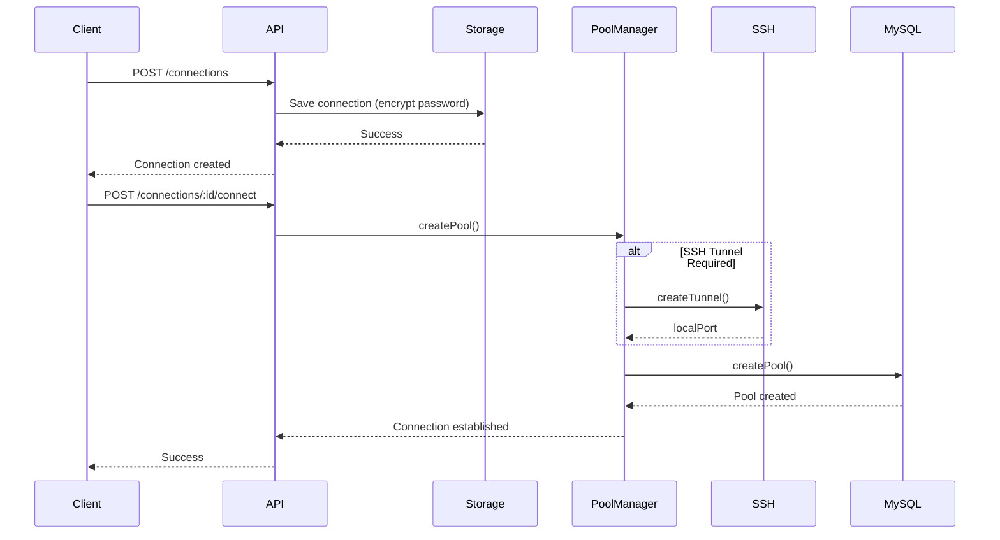
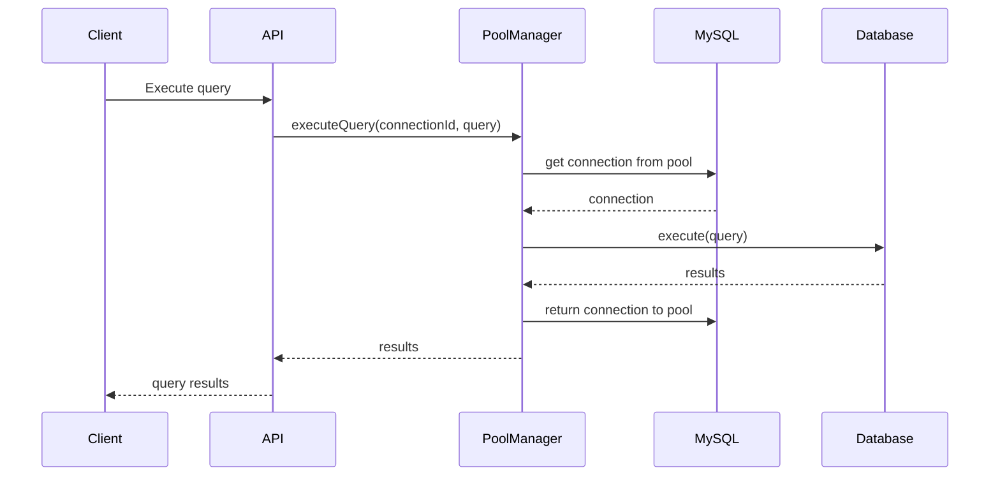
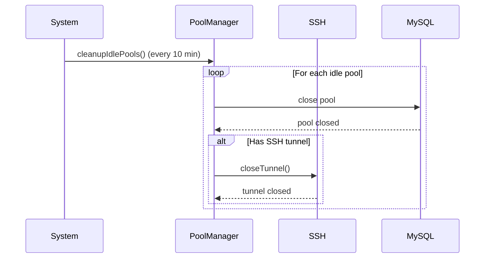

# MySQL Connection Handling

## Overview

The MySQL connection handling system provides secure, efficient, and reliable database connectivity with support for SSH tunneling, connection pooling, encryption, and persistent storage. The system is designed to handle multiple database connections while maintaining optimal performance and security.

## Architecture

### Core Components

```
┌─────────────────────────────────────────────────────────────┐
│                    Connection Layer                          │
├─────────────────────────────────────────────────────────────┤
│  API Routes (/server/routes/connections.ts)                 │
│  - Connection CRUD operations                               │
│  - Connection testing and management                        │
├─────────────────────────────────────────────────────────────┤
│  Connection Pool Manager (/server/services/ConnectionPoolManager.ts) │
│  - Pool creation and management                             │
│  - Connection lifecycle                                     │
│  - SSH tunnel coordination                                  │
├─────────────────────────────────────────────────────────────┤
│  Connection Storage (/server/services/ConnectionStorage.ts) │
│  - Persistent connection storage                            │
│  - Encryption/decryption                                    │
│  - File-based backup and recovery                           │
├─────────────────────────────────────────────────────────────┤
│  SSH Tunnel Manager (/server/services/SSHTunnelManager.ts)  │
│  - Secure tunneling to remote databases                     │
│  - Port forwarding and connection relay                     │
├─────────────────────────────────────────────────────────────┤
│  Encryption Service (/server/services/EncryptionService.ts) │
│  - Password and sensitive data encryption                   │
│  - Cross-platform encryption support                        │
├─────────────────────────────────────────────────────────────┤
│  MySQL2 Pool (mysql2/promise)                               │
│  - Native connection pooling                                │
│  - Query execution and management                           │
└─────────────────────────────────────────────────────────────┘
```

## Connection Configuration

### ConnectionConfig Interface

```typescript
interface ConnectionConfig {
  id: string;                    // Unique identifier
  name: string;                  // Human-readable name
  group?: string;                // Optional grouping
  environment?: ConnectionEnvironment; // Environment tag
  host: string;                  // MySQL server host
  port: number;                  // MySQL server port
  database: string;              // Default database
  username: string;              // Authentication username
  password?: string;             // Encrypted password
  sshTunnel?: SSHTunnelConfig;   // SSH tunnel configuration
  createdAt: string;             // Creation timestamp
  lastUsed?: string;            // Last usage timestamp
}
```

### SSH Tunnel Configuration

```typescript
interface SSHTunnelConfig {
  enabled: boolean;              // Enable/disable tunneling
  host: string;                  // SSH server host
  port: number;                  // SSH server port
  username: string;              // SSH authentication username
  password?: string;             // SSH password (optional)
  privateKey?: string;           // SSH private key (optional)
}
```

## Connection Management

### 1. Connection Storage (`ConnectionStorage`)

The `ConnectionStorage` class manages persistent storage of connection configurations with automatic encryption and backup capabilities.

#### Key Features:
- **File-based storage**: Uses JSON files in `data/connections.json`
- **Automatic encryption**: Encrypts passwords before storage
- **Backup management**: Creates automatic backups
- **Migration support**: Handles legacy plain-text password migration
- **Atomic operations**: Ensures data integrity during save operations

#### Storage Structure:
```json
{
  "connections": [
    {
      "id": "uuid-here",
      "name": "Production DB",
      "host": "db.example.com",
      "port": 3306,
      "database": "myapp",
      "username": "appuser",
      "password": "enc:v1:encrypted_password_here",
      "sshTunnel": {
        "enabled": true,
        "host": "bastion.example.com",
        "port": 22,
        "username": "dbuser"
      },
      "group": "production",
      "environment": "production",
      "createdAt": "2025-11-10T10:00:00.000Z",
      "lastUsed": "2025-11-10T15:30:00.000Z"
    }
  ]
}
```

#### Methods:
- `initialize()`: Initialize storage and load connections
- `getAll()`: Retrieve all connections
- `getById(id)`: Get specific connection by ID
- `save(connection)`: Save new connection
- `update(id, updates)`: Update existing connection
- `delete(id)`: Delete connection
- `updateLastUsed(id)`: Update last used timestamp

### 2. Connection Pool Manager (`ConnectionPoolManager`)

The `ConnectionPoolManager` handles MySQL connection pooling with SSH tunnel support and automatic pool cleanup.

#### Default Pool Configuration:
```typescript
const defaultPoolOptions: MySQLPoolOptions = {
  connectionLimit: 10,           // Maximum connections per pool
  waitForConnections: true,      // Queue requests when limit reached
  queueLimit: 0,                 // Unlimited queue size
  enableKeepAlive: true,         // Keep connections alive
  keepAliveInitialDelay: 0,      // Initial keep-alive delay
};
```

#### Pool Lifecycle:
1. **Creation**: Pool created on first connection request
2. **Usage**: Connections allocated from pool for queries
3. **Idle Management**: Periodic cleanup of idle pools (10-minute interval)
4. **Closure**: Pool closed on server shutdown or explicit removal

#### SSH Tunnel Integration:
```typescript
// SSH tunnel creates local port forwarding
Host: target-db.example.com:3306
  ↓
SSH Tunnel (bastion.example.com:22)
  ↓
Local: 127.0.0.1:50000
  ↓
MySQL Pool connects to localhost:50000
```

#### Key Methods:
- `createPool(config)`: Create or get existing pool
- `getPool(connectionId)`: Get pool by connection ID
- `executeQuery(connectionId, query)`: Execute query using pool
- `testConnection(config)`: Test connection without persistent pool
- `cleanupIdlePools()`: Remove unused pools
- `closeAllPools()`: Close all pools (shutdown)

### 3. SSH Tunnel Manager (`SSHTunnelManager`)

Manages SSH tunnel creation and lifecycle for secure database access.

#### Tunnel Creation Process:
1. **Port Selection**: Automatically find available local port (50000-60000)
2. **SSH Connection**: Establish SSH connection to bastion host
3. **Local Server**: Create local TCP server on chosen port
4. **Forwarding Setup**: Configure SSH port forwarding
5. **Connection Relay**: Relay local connections through SSH tunnel

#### Tunnel Management:
- **Reuse**: Existing tunnels reused for same connection ID
- **Port Allocation**: Dynamic port allocation with collision detection
- **Error Handling**: Comprehensive error handling and cleanup
- **Lifecycle**: Automatic cleanup on tunnel closure

#### Key Methods:
- `createTunnel(tunnelId, sshConfig, targetHost, targetPort)`: Create new tunnel
- `closeTunnel(tunnelId)`: Close existing tunnel
- `isTunnelActive(tunnelId)`: Check tunnel status

## API Endpoints

### Connection Management

#### GET `/api/connections`
Retrieve all stored connections (passwords encrypted).

**Response:**
```json
{
  "connections": [
    {
      "id": "uuid",
      "name": "Production DB",
      "host": "db.example.com",
      "port": 3306,
      "database": "myapp",
      "username": "appuser",
      "password": "enc:v1:encrypted_password",
      // ... other fields
    }
  ]
}
```

#### POST `/api/connections`
Create new connection with automatic password encryption.

**Request:**
```json
{
  "name": "Production DB",
  "host": "db.example.com",
  "port": 3306,
  "database": "myapp",
  "username": "appuser",
  "password": "plaintext_password",
  "sshTunnel": {
    "enabled": true,
    "host": "bastion.example.com",
    "port": 22,
    "username": "dbuser",
    "password": "ssh_password"
  },
  "group": "production"
}
```

#### PUT `/api/connections/:id`
Update existing connection configuration.

#### DELETE `/api/connections/:id`
Delete connection and cleanup associated resources.

### Connection Operations

#### POST `/api/connections/:id/test`
Test connection without creating persistent pool.

**Response:**
```json
{
  "success": true,
  "message": "Connection successful",
  "serverVersion": "8.0.35"
}
```

#### POST `/api/connections/:id/connect`
Establish connection and create connection pool.

**Request:**
```json
{
  "password": "connection_password"
}
```

#### POST `/api/connections/:id/disconnect`
Disconnect and close connection pool.

#### GET `/api/connections/:id/stats`
Get connection pool statistics and status.

**Response:**
```json
{
  "stats": {
    "activeConnections": 3,
    "idleConnections": 2,
    "totalConnections": 5,
    "pendingRequests": 0,
    "maxConnections": 10
  }
}
```

## Security Features

### Password Encryption

The system uses a two-layer encryption approach:

1. **Electron Environment**: Uses OS keychain (Windows DPAPI, macOS Keychain, Linux Secret Service)
2. **Web Environment**: Fallback AES-256-GCM encryption with machine-specific key

#### Encryption Format:
```
enc:v1:base64_encrypted_data
```

#### Migration Process:
- Automatically detects plain-text passwords
- Migrates to encrypted format on first use
- Preserves data integrity during migration

### SSH Tunnel Security

- **Key-based Authentication**: Supports private key authentication
- **Password Authentication**: Optional password-based auth
- **Port Security**: Uses high-numbered ports (50000-60000)
- **Connection Isolation**: Each connection gets isolated tunnel

### Data Protection

- **At-rest Encryption**: All sensitive data encrypted in storage
- **In-transit Protection**: SSH tunnels provide encrypted channels
- **Memory Security**: Passwords cleared from memory after use
- **Backup Encryption**: Backup files also contain encrypted data

## Connection Lifecycle

### 1. Connection Creation


### 2. Query Execution


### 3. Connection Cleanup


## Error Handling

### Connection Errors
- **Network Issues**: Timeout and retry logic
- **Authentication Failures**: Clear error messages
- **SSH Tunnel Failures**: Fallback to direct connection if tunnel fails
- **Pool Exhaustion**: Queue management with configurable limits

### Recovery Mechanisms
- **Auto-reconnect**: Automatic reconnection on connection loss
- **Pool Recreation**: Automatic pool recreation on errors
- **Tunnel Recreation**: Automatic tunnel recreation on SSH failures
- **Backup Restoration**: Automatic backup restoration on corruption

## Performance Optimization

### Connection Pooling Benefits
- **Reduced Overhead**: Reuse existing connections
- **Connection Limits**: Prevent database overload
- **Load Balancing**: Distribute load across connections
- **Resource Management**: Automatic cleanup of idle connections

### SSH Tunnel Optimization
- **Connection Reuse**: Reuse tunnels for multiple queries
- **Port Management**: Efficient local port allocation
- **Keep-alive**: Maintain tunnel connections
- **Error Recovery**: Quick tunnel recreation on failure

## Configuration

### Environment Variables
```bash
# SSH Tunnel Port Range
SSH_TUNNEL_PORT_MIN=50000
SSH_TUNNEL_PORT_MAX=60000

# Connection Pool Defaults
MYSQL_POOL_LIMIT=10
MYSQL_QUEUE_LIMIT=0
MYSQL_KEEPALIVE=true

# Encryption
ENCRYPTION_KEY_ROTATION_DAYS=90
```

### Pool Configuration Options
```typescript
interface MySQLPoolOptions extends PoolOptions {
  connectionLimit?: number;    // Max connections (default: 10)
  waitForConnections?: boolean; // Queue when limit reached (default: true)
  queueLimit?: number;         // Max queue size (default: 0 = unlimited)
  enableKeepAlive?: boolean;   // Keep connections alive (default: true)
  keepAliveInitialDelay?: number; // Initial keep-alive delay (default: 0)
}
```

## Monitoring and Observability

### Connection Metrics
- **Active Connections**: Currently used connections
- **Idle Connections**: Available but unused connections
- **Pending Requests**: Queued connection requests
- **Pool Utilization**: Percentage of pool capacity used
- **Response Times**: Query execution performance

### Health Checks
- **Connection Status**: Active/inactive pool status
- **SSH Tunnel Health**: Tunnel connectivity status
- **Database Reachability**: MySQL server availability
- **Authentication Status**: Login success/failure rates

### Logging
- **Connection Events**: Creation, usage, closure
- **Error Tracking**: Detailed error logging
- **Performance Metrics**: Query timing and pool statistics
- **Security Events**: Authentication attempts and failures

## Troubleshooting

### Common Issues

#### Connection Timeouts
```
Error: connect ETIMEDOUT
```
**Solution**: Check network connectivity, increase timeout values, verify firewall rules

#### SSH Tunnel Failures
```
Error: SSH tunnel failed: Auth failure
```
**Solution**: Verify SSH credentials, check bastion host accessibility, ensure port forwarding permissions

#### Pool Exhaustion
```
Error: Too many connections
```
**Solution**: Increase pool size, optimize connection usage, implement connection recycling

#### Encryption Issues
```
Error: Failed to decrypt password
```
**Solution**: Check encryption keys, verify machine-specific data consistency, reset encrypted passwords

### Debug Mode
Enable detailed logging:
```typescript
// In development environment
process.env.DEBUG_MYSQL_CONNECTIONS = 'true';
```

This will log:
- Connection creation/destruction
- Pool operations
- SSH tunnel establishment/closure
- Query execution timing
- Error details

## Best Practices

### Connection Management
1. **Use Connection Pools**: Always prefer pools over single connections
2. **Set Appropriate Limits**: Configure pool size based on database capacity
3. **Monitor Usage**: Track connection utilization and adjust limits
4. **Regular Cleanup**: Ensure idle pools are cleaned up regularly

### Security
1. **Use SSH Tunnels**: Always use SSH for remote database access
2. **Rotate Credentials**: Regularly update passwords and SSH keys
3. **Encrypt Everything**: Ensure all sensitive data is encrypted
4. **Limit Access**: Use least-privilege principle for database users

### Performance
1. **Optimize Queries**: Use efficient SQL and proper indexing
2. **Connection Reuse**: Minimize connection creation/destruction
3. **Pool Sizing**: Right-size pools based on application load
4. **Keep-alive**: Enable connection keep-alive for better performance

### Monitoring
1. **Track Metrics**: Monitor connection usage and performance
2. **Alert on Issues**: Set up alerts for connection failures
3. **Regular Health Checks**: Implement periodic connection testing
4. **Log Analysis**: Analyze logs for patterns and issues

## Future Enhancements

### Planned Features
- **Read/Write Splitting**: Separate read and write connection pools
- **Connection Load Balancing**: Distribute load across multiple replicas
- **Advanced Monitoring**: Integration with external monitoring systems
- **Connection Templates**: Predefined connection configurations
- **Automatic Failover**: Support for master-slave failover scenarios

### Potential Improvements
- **Connection Metrics Export**: Prometheus/Graphite integration
- **Advanced SSH Features**: SSH key rotation and certificate support
- **Database Discovery**: Automatic database schema discovery
- **Connection Analytics**: Usage patterns and optimization recommendations

---

*This document describes the MySQL connection handling system as of the current implementation. For the most up-to-date information, refer to the source code in the `/server` directory.*